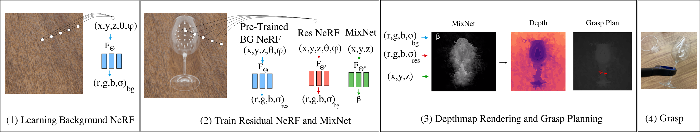

# Residual-NeRF
### [Project Page](https://residual-nerf.github.io/) | [Video](https://youtu.be/oA2CkRFI61c?si=BLFGDBOXMaw_i4DD) | [Paper]() | [Data](https://drive.google.com/drive/folders/15r_mLt8MD5-AuYfoWCLy72hD27-tHA2N?usp=sharing)
Official implementation of Residual NeRF.<br><br>
[Residual-NeRF: Learning Residual NeRFs for Transparent Object Manipulation](https://residual-nerf.github.io/)  
 [Bardienus P. Duisterhof](https://bart-ai.com)<sup>1</sup>,
 [Yuemin Mao](https://yueminm.github.io/)<sup>1</sup>,
 [Si Heng Teng](https://www.ri.cmu.edu/ri-people/si-heng-teng/)<sup>1</sup>,
 [Jeffrey Ichnowski](https://ichnow.ski/)<sup>1</sup> <br>
 <sup>1</sup>Carnegie Mellon University, the Robotics Institute <br>
in International Conference on Robotics and Automation (ICRA) 2024



## Installation

### Docker
```bash
docker pull bartduis/torch-ngp:latest
docker run -it --runtime=nvidia --gpus all -v /path/to/Residual-NeRF:/workspace bartduis/torch-ngp:latest
```

### Install with pip
```bash
pip install -r requirements.txt
```

### Install with conda
```bash
conda env create -f environment.yml
conda activate torch-ngp
```

## Download the Data
You can access the data from [here](https://drive.google.com/drive/folders/15r_mLt8MD5-AuYfoWCLy72hD27-tHA2N?usp=sharing). You can also download all data with the following command:
```bash
gdown --folder https://drive.google.com/drive/folders/15r_mLt8MD5-AuYfoWCLy72hD27-tHA2N --remaining-ok 
```

The data should have the following structure:
```
data
├── bowl_rgb
│   ├── train 
│   │   ├── r_0_-1.png
│   │   ├── r_0_0.png
│   │   └── ...
│   ├── test
│   │   ├── r_0_-1.png
│   │   ├── r_0_0.png
│   │   └── ...
│   ├── val
│   │   ├── r_0_-1.png
│   │   ├── r_0_0.png
│   │   └── ...
│   └── gt_depth.npy
```
For each image, the first integer is the view id whereas 

## Usage


# Citation

    @inproceedings{duisterhof2024residualnerf,
      title={Residual-NeRF: Learning Residual NeRFs for Transparent Object Manipulation}, 
      author={Bardienus P. Duisterhof and Yuemin Mao and Si Heng Teng and Jeffrey Ichnowski},
      year={2024},
      booktitle={ICRA 2024}
    }

